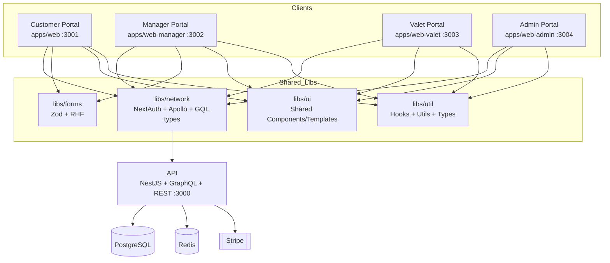
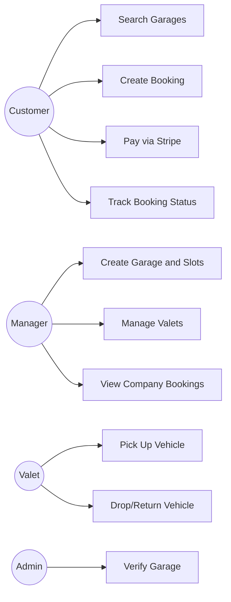
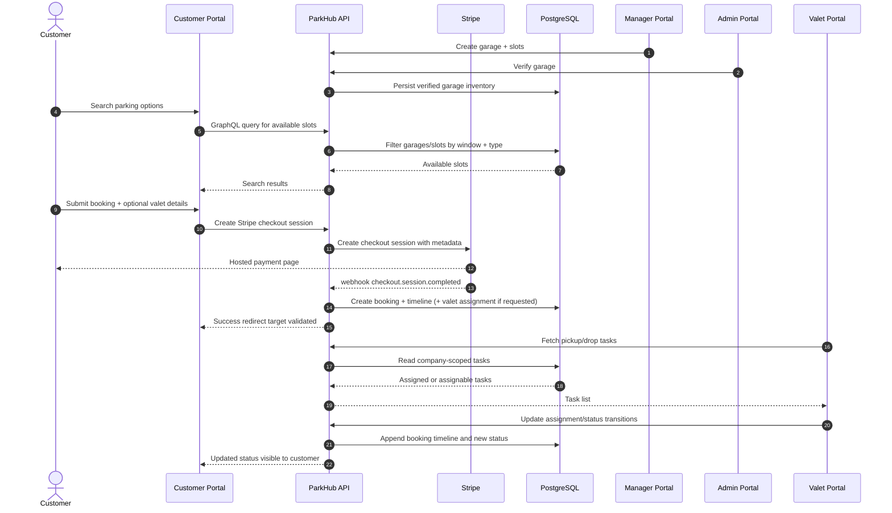
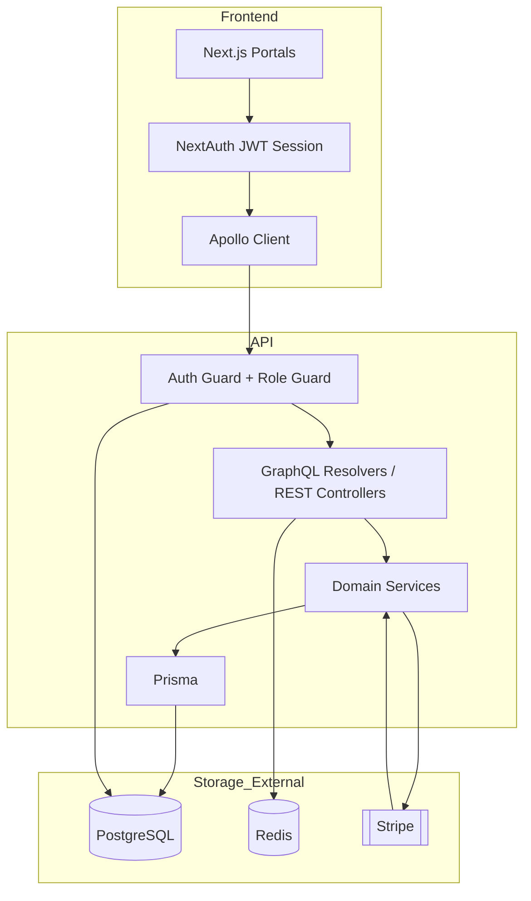

# ParkHub Architecture Handbook

This document provides a comprehensive overview of the ParkHub monorepo, including structure, tech stack, workflows, domain models, and business flows. For quick setup, see the root README.

---

## 1) Monorepo Structure

... (see [README.md](../README.md) for full content)

---

## 2) Tech Stack

... (see [README.md](../README.md) for full content)

---

## 3) Port and App Matrix

... (see [README.md](../README.md) for full content)

---

## 4) High-Level Architecture Diagram

---

## 5) Core Backend Domain Model

... (see [README.md](../README.md) for full content)

---

## 6) User Workflow (Role-wise)

... (see [README.md](../README.md) for full content)

---

## 7) Use Case Diagram (Mermaid)

---

## 8) End-to-End Business Flow (Customer → Valet)

---

## 9) Technical Data Flow Diagram

---

## 10) Authentication and Authorization

... (see [README.md](../README.md) for full content)

---

## 11) Local Development Setup

... (see [README.md](../README.md) for full content)

---

## 12) Environment Variables

... (see [README.md](../README.md) for full content)

---

## 13) Useful Commands

... (see [README.md](../README.md) for full content)

---

## 14) Stripe Webhook Testing (Local)

... (see [README.md](../README.md) for full content)

---

## 15) Operational Notes

... (see [README.md](../README.md) for full content)

---

## 16) Current End-to-End Summary

... (see [README.md](../README.md) for full content)

---

For detailed explanations, see the root README or this file’s sections above.
