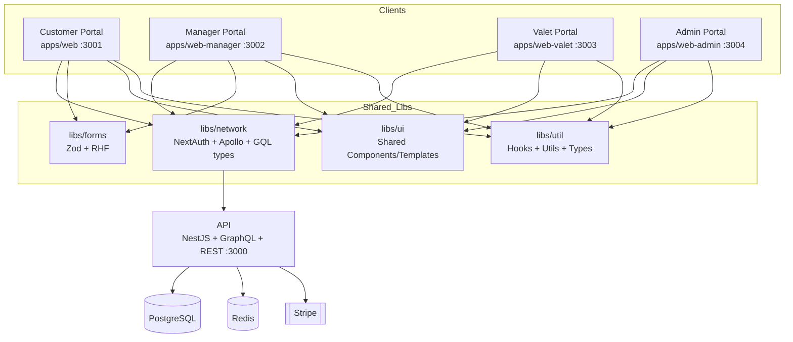

```mermaid
flowchart TB
  subgraph Clients
    C[Customer Portal\napps/web :3001]
    M[Manager Portal\napps/web-manager :3002]
    V[Valet Portal\napps/web-valet :3003]
    A[Admin Portal\napps/web-admin :3004]
  end

  subgraph Shared_Libs
    N[libs/network\nNextAuth + Apollo + GQL types]
    F[libs/forms\nZod + RHF]
    U[libs/ui\nShared Components/Templates]
    T[libs/util\nHooks + Utils + Types]
  end

  C --> N
  M --> N
  V --> N
  A --> N
  C --> F
  M --> F
  C --> U
  M --> U
  V --> U
  A --> U
  C --> T
  M --> T
  V --> T
  A --> T

  N --> API[API\nNestJS + GraphQL + REST :3000]
  API --> DB[(PostgreSQL)]
  API --> REDIS[(Redis)]
  API --> STRIPE[[Stripe]]
```